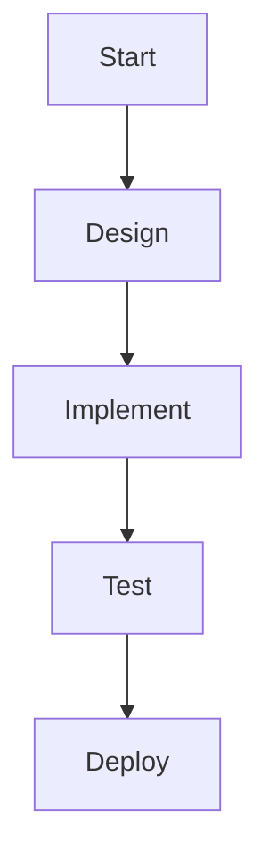

# Notebook Renderer

A clean, plug-and-play rendering library that transforms Markdown, Mermaid diagrams, and math into beautiful hand-drawn style notebook paper images.

## Features

- **Paper Engine** — Renders Markdown onto realistic notebook paper with:
  - Lined/grid backgrounds with ring-binder holes
  - Multi-color semantic ink (red for strong, green for emphasis, etc.)
  - Hand-drawn typography using Google Fonts
  - Grid-snapped layout for perfect alignment
  - Native RTL (right-to-left) text support
  
- **Sketch Engine** — Post-processes Mermaid diagrams with:
  - Rough.js hand-drawn styling
  - Ghost lines and hachure fills
  - Pencil/ballpen textures
  - Palette-driven auto-coloring
  - Special handling for Pie, Gantt, XY charts, and Mindmaps

- **JSON Presets** — All styling is configurable via JSON preset files:
  - 5 starter presets included (`blue-bic`, `pencil-grid`, `journal-warm`, `pastel-soft`, `bold-ink`)
  - Inheritance system with `extends` field
  - Real-time Designer for creating custom presets

- **Pagination** — Optional page splitting for:
  - A4, Letter, Phone screen formats
  - Custom dimensions
  - Smart content splitting with overlap protection

- **Host Agnostic** — Use from:
  - Python scripts (via Playwright headless browser)
  - Telegram bots
  - Websites (client-side or server-side)
  - Node.js services

## Quick Start

### Python

```python
from notebook_renderer import render_markdown

# Simple usage
png_bytes = render_markdown("# Hello World\n\nThis is a **test**.", preset="blue-bic")

# Save to file
with open("output.png", "wb") as f:
    f.write(png_bytes)

# With pagination (returns list of PNGs)
pages = render_markdown("# Long document...", preset="blue-bic", paginate=True)
for i, page in enumerate(pages):
    with open(f"page_{i}.png", "wb") as f:
        f.write(page)
```

### JavaScript (Website)

```javascript
import PaperRenderer from './core/paper-renderer.js';

const renderer = new PaperRenderer('blue-bic');
await renderer.render('# Hello World', document.getElementById('target'));
```

## Installation

### From PyPI (coming soon)
```bash
pip install notebook-renderer
```

### From Source
```bash
git clone https://github.com/yourusername/notebook-renderer.git
cd notebook-renderer/python
pip install -e .
```

## Included Presets

| Preset | Description | Best For |
|--------|-------------|----------|
| `blue-bic` | Classic blue ballpen on ruled paper | Default, everyday notes |
| `pencil-grid` | Graphite pencil on grid paper | Technical sketches |
| `journal-warm` | Warm-tone journal aesthetic | Personal journals |
| `pastel-soft` | Soft pastel palette | Gentle, calming notes |
| `bold-ink` | Bold and vibrant inks | High-contrast emphasis |

## Usage Examples

### Render Mermaid Diagrams

```markdown
# My Project Plan


```

### Render Math

```markdown
# Physics Notes

The famous equation:

```math
E = mc^2
```

And the Schrödinger equation:

```math
i\\hbar\\frac{\\partial}{\\partial t}\\psi = \\hat{H}\\psi
```
```

### Custom Preset

```json
{
  "name": "my-custom",
  "version": 1,
  "extends": "blue-bic",
  "paper": {
    "fontSize": 32,
    "gridSize": 40
  },
  "sketch": {
    "seed": 123,
    "roughness": 2.0
  }
}
```

## Architecture

```
┌─────────────────────────────────────┐
│ Consumers                           │
│ Python · Telegram · Website · Node  │
└─────────────────────────────────────┘
                ↑
┌─────────────────────────────────────┐
│ Hosts                               │
│ Designer (interactive)              │
│ Renderer (headless)                 │
└─────────────────────────────────────┘
                ↑
┌─────────────────────────────────────┐
│ Core Engines                        │
│ paper-renderer.js                   │
│ mermaid-sketch.js                   │
│ pagination.js                       │
│ preset-loader.js                    │
│ utils/                              │
└─────────────────────────────────────┘
                ↑
┌─────────────────────────────────────┐
│ Presets (JSON)                      │
│ blue-bic.json · pencil-grid.json    │
│ journal-warm.json · etc.            │
└─────────────────────────────────────┘
```

## Development

### Running the Designer

```bash
cd notebook-renderer/hosts
# Open designer.html in a browser (use Live Server extension)
```

### Testing

```bash
cd notebook-renderer
npm test  # JS unit tests
pytest python/tests/  # Python integration tests
```

## Roadmap

- [ ] Phase 1: Extract core engines from legacy HTML files
- [ ] Phase 2: Complete preset system with validation
- [ ] Phase 3: Utility modules (color, svg, ready, seed)
- [ ] Phase 4: Pagination engine
- [ ] Phase 5: Headless renderer host
- [ ] Phase 6: Python wrapper with Playwright
- [ ] Phase 7: Designer refactor
- [ ] Phase 8: Self-hosted vendor libraries
- [ ] Phase 9: Testing and documentation

See `NOTEBOOK_RENDERER_PLAN.md` for detailed implementation plan.

## License

MIT License - See LICENSE file for details.

## Credits

Built with:
- [Mermaid](https://mermaid.js.org/) - Diagramming
- [Rough.js](https://roughjs.com/) - Hand-drawn graphics
- [KaTeX](https://katex.org/) - Math typesetting
- [Marked.js](https://marked.js.org/) - Markdown parsing
- [Playwright](https://playwright.dev/) - Headless browser automation
